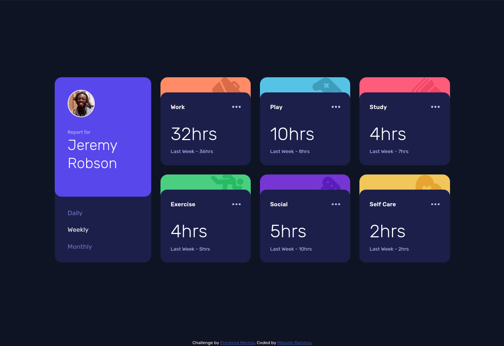
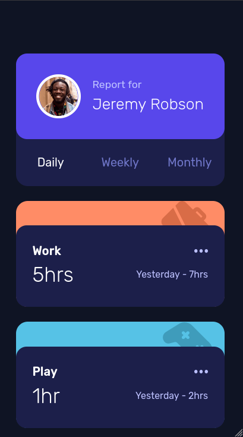

# Frontend Mentor - Time tracking dashboard solution

This is a solution to the [Time tracking dashboard challenge on Frontend Mentor](https://www.frontendmentor.io/challenges/time-tracking-dashboard-UIQ7167Jw). Frontend Mentor challenges help you improve your coding skills by building realistic projects. 

## Table of contents

- [Frontend Mentor - Time tracking dashboard solution](#frontend-mentor---time-tracking-dashboard-solution)
  - [Table of contents](#table-of-contents)
  - [Overview](#overview)
    - [The challenge](#the-challenge)
    - [Screenshot](#screenshot)
      - [Desktop](#desktop)
      - [Mobile](#mobile)
    - [Links](#links)
  - [My process](#my-process)
    - [Built with](#built-with)
    - [Useful resources](#useful-resources)
  - [Author](#author)

## Overview

### The challenge

Users should be able to:

- View the optimal layout for the site depending on their device's screen size
- See hover states for all interactive elements on the page
- Switch between viewing Daily, Weekly, and Monthly stats

### Screenshot

#### Desktop

#### Mobile

### Links

- Solution URL: TODO

## My process

### Built with

- Semantic HTML5 markup
- CSS custom properties
- Flexbox
- CSS Grid
- Mobile-first workflow
- Vanilla JS

### Useful resources

- [A modern Reset CSS](https://www.super-simple.net/blog/un-css-reset-moderno/) - This helped me to reduce browser inconsistencies. It's an evolution from the one I previously used, and includes new stuff such as animation and transitions removal for people who explicitly don't want them. 
- [BEM CSS framework](https://getbem.com/) - The official website for BEM framework. I'd recommend it to anyone who uses custom CSS properties.
- [W3Schools examples](https://www.w3schools.com/js/js_dom_examples.asp) - This allowed me to understand better how vanilla javascript works for DOM manipulation.

## Author

- GitHub - [Miguelo0098](https://www.your-site.com)
- Frontend Mentor - [@Miguelo0098](https://www.frontendmentor.io/profile/Miguelo0098)
- Twitter - [@miguelo0098](https://www.twitter.com/miguelo0098)
